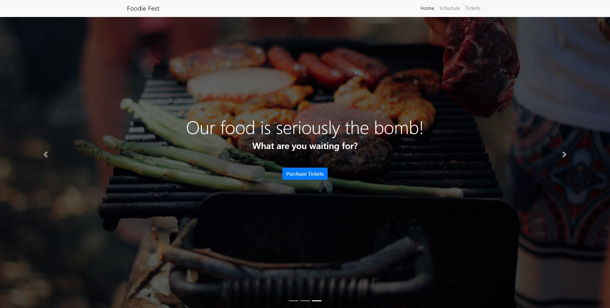

# Foodie Fest (PWA)

## Description
Foodie Fest is a delicious progressive web application (PWA) that engages foodies to check out upcoming events and purchase a variety of ticket packages.  The app also provides offline functionality and access to allow for versatility and optimize the foodie experience.  Foodies can explore the website or downloaded the app version.  Whether you're in an area with spotty reception or fighting for your spot on a crowded wifi network - Foodie Fest is there for you!

## Screenshot

## **Table of Contents**
* [Screenshot](#screenshot)
* [Programs](#programs)
* [Installation](#installation)
* [License](#license)
* [Questions](#questions)

## **Screenshot**

## **Programs**
* CSS
* Express
* file-loader plugin
* HTML
* image-webpack-loader plugin
* JavaScript
* Node
* SW-precache-webpack plugin
* webpack
* webpack-bundle-analyzer plugin
* webpack-PWA-manifest plugin

## **Installation**
***Note: Using Chrome is highly recommended for the optimal experience***
1. To download the app version, open Chrome on your computer or smart phone
2. Visit the [Foodie Fest website](https://christopherlawn.github.io/food-festival/)
3. At the top right of the address bar, click the install button which may be in the form of a `+` or a desktop computer icon
4. Follow the onscreen instructions to install
5. Click the app icon on your desktop or smart phone home screen to open the app!

## **License**
The project is distributed under the [Creative Commons License](https://creativecommons.org/publicdomain/zero/1.0/)

## **Questions**
Please contact me directly with any additional questions:
* [GitHub](https://github.com/ChristopherLawn)
* [Email](mailto:christopher.d.lawn@gmail.com)